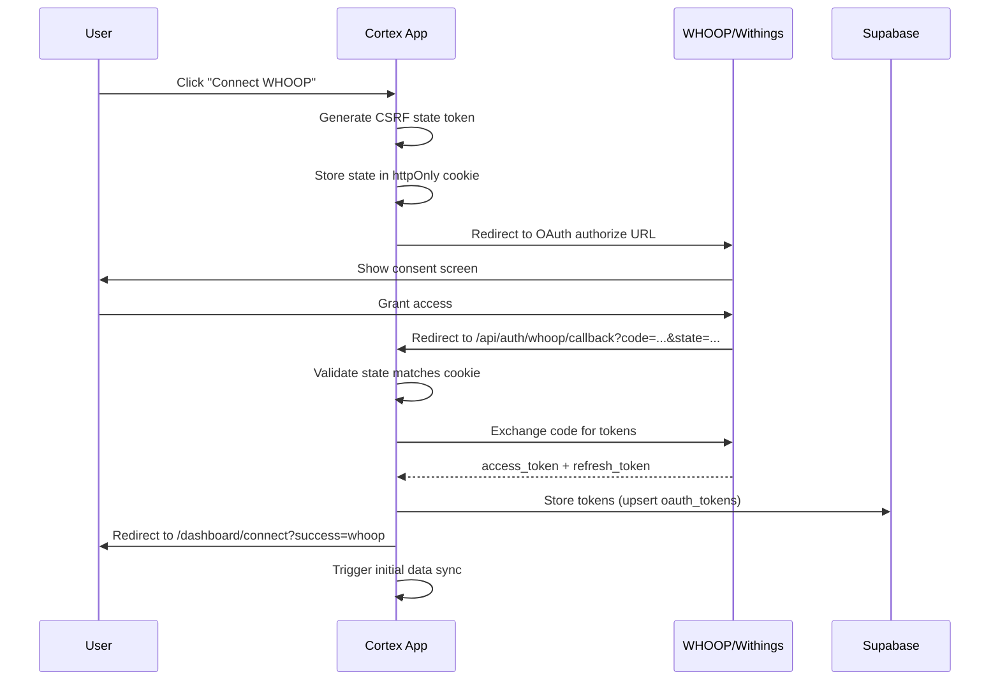
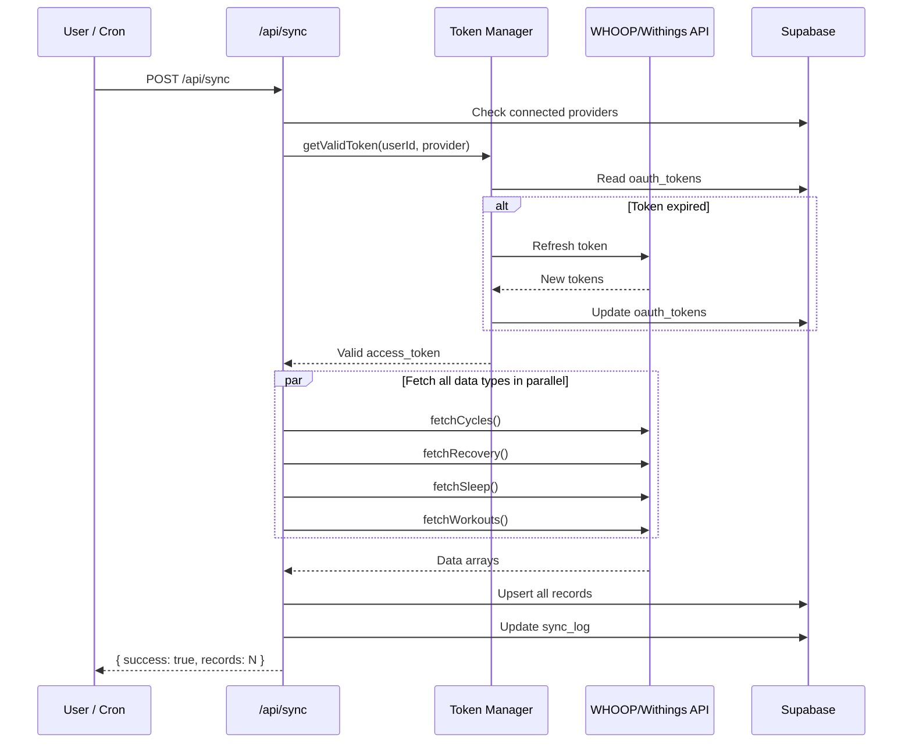
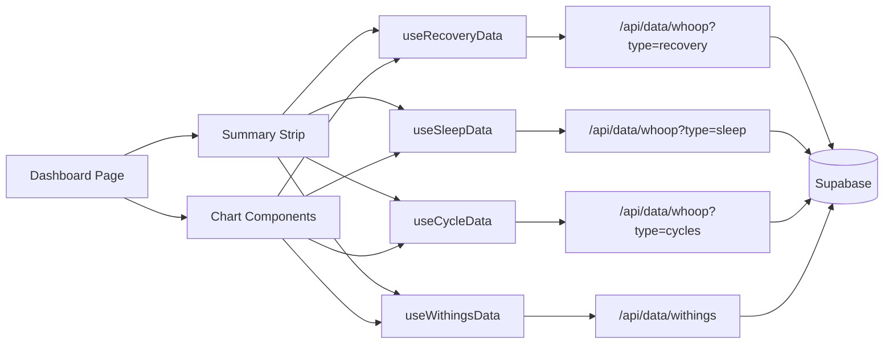

# Architecture

## System Overview

Cortex is a health data aggregation platform that pulls biometric data from WHOOP and Withings into a unified dashboard. It runs as a Next.js application backed by Supabase (PostgreSQL + Auth).

```
+------------------------------------------------------------------+
|                         CORTEX SYSTEM                            |
+------------------------------------------------------------------+
|                                                                  |
|  +-----------+     +----------------+     +-----------------+    |
|  |  Browser  |<--->| Next.js App    |<--->|    Supabase      |    |
|  |  (React)  |     | (API Routes)   |     |  (PostgreSQL)    |    |
|  +-----------+     +-------+--------+     +-----------------+    |
|                            |                                     |
|                   +--------+--------+                            |
|                   |                 |                             |
|            +------v-----+   +------v------+                      |
|            |  WHOOP API |   | Withings API|                      |
|            +------------+   +-------------+                      |
|                                                                  |
+------------------------------------------------------------------+
```

## Request Flow

```
User Browser
    |
    |  HTTPS
    v
+------------------+
|   Middleware      |  -- Session refresh, auth redirect
+------------------+
    |
    v
+------------------+
|  Next.js Router  |  -- App Router (src/app/)
+--------+---------+
         |
    +----+----+
    |         |
    v         v
  Pages    API Routes
(React)   (Server)
    |         |
    v         v
 Hooks     Supabase
(fetch)    (query)
```

## Data Flow: OAuth Connection



## Data Flow: Sync



## Data Flow: Dashboard Rendering



## Tech Stack

| Layer | Technology | Purpose |
|-------|-----------|---------|
| Framework | Next.js 16 (App Router) | SSR, API routes, routing |
| UI | React 19, Tailwind CSS 4 | Component rendering, styling |
| Charts | Recharts 3 | Data visualization |
| State | Zustand, React Query | Client state, server state cache |
| Auth | Supabase Auth (Google OAuth) | User authentication |
| Database | Supabase (PostgreSQL) | Data persistence, RLS |
| Icons | Heroicons | UI iconography |
| Deployment | Vercel | Hosting, cron jobs, edge functions |

## Directory Structure

```
src/
+-- app/                    # Next.js App Router
|   +-- (auth)/             # Auth route group (login, signup, callback)
|   +-- api/                # API routes
|   |   +-- auth/           #   OAuth initiation & callbacks
|   |   +-- cron/           #   Vercel cron job endpoint
|   |   +-- data/           #   Data query endpoints
|   |   +-- sync/           #   Manual sync triggers
|   +-- dashboard/          # Main dashboard pages
|   +-- layout.tsx          # Root layout (fonts, providers)
|   +-- globals.css         # Design system tokens & base styles
|
+-- components/
|   +-- cards/              # Standalone metric cards
|   +-- charts/             # Recharts-based chart components
|   +-- layout/             # Header, summary strip
|   +-- providers/          # React Query, theme context
|   +-- ui/                 # Primitives (Card, Skeleton, DatePicker)
|
+-- lib/
|   +-- api/                # External API clients (WHOOP, Withings)
|   +-- hooks/              # React hooks for data fetching
|   +-- supabase/           # Supabase client factories
|   +-- sync/               # Sync orchestration logic
|   +-- utils/              # Formatters, constants, helpers
|
+-- types/                  # TypeScript type definitions
```

## Key Design Decisions

1. **Server-side auth checks in API routes**: Every API route independently validates the user via `supabase.auth.getUser()` rather than relying solely on middleware. This provides defense-in-depth.

2. **Upsert-based sync**: All data sync uses `upsert` with conflict keys (e.g., `user_id,whoop_cycle_id`) so syncs are idempotent and safe to re-run.

3. **Parallel API fetches**: WHOOP data types (cycles, recovery, sleep, workouts) are fetched via `Promise.all()` to eliminate request waterfalls.

4. **React Query for server state**: All dashboard data flows through React Query with a 5-minute `staleTime`, providing automatic caching, deduplication, and background refetching.

5. **Zustand for client state**: Date range selection is managed in Zustand with localStorage persistence, keeping URL-independent UI state simple.

6. **Row-Level Security**: Supabase RLS policies ensure users can only read/write their own data, providing database-level access control regardless of application bugs.
