# Database Schema

Cortex uses Supabase (PostgreSQL) with Row-Level Security (RLS) enabled on all tables.

## Entity Relationship Diagram

```mermaid
erDiagram
    auth_users ||--o{ oauth_tokens : has
    auth_users ||--o{ whoop_cycles : has
    auth_users ||--o{ whoop_recovery : has
    auth_users ||--o{ whoop_sleep : has
    auth_users ||--o{ whoop_workouts : has
    auth_users ||--o{ withings_measurements : has
    auth_users ||--o{ sync_log : has

    oauth_tokens {
        uuid id PK
        uuid user_id FK
        text provider "whoop | withings"
        text access_token
        text refresh_token
        timestamptz expires_at
        text provider_user_id
        timestamptz created_at
        timestamptz updated_at
    }

    whoop_cycles {
        uuid id PK
        uuid user_id FK
        text whoop_cycle_id UK
        timestamptz start_time
        timestamptz end_time
        real strain
        real kilojoule
        int average_heart_rate
        int max_heart_rate
        real calories_kcal
        jsonb raw_json
    }

    whoop_recovery {
        uuid id PK
        uuid user_id FK
        text whoop_cycle_id UK
        real recovery_score
        real resting_heart_rate
        real hrv_rmssd_milli
        real spo2_percentage
        real skin_temp_celsius
        boolean user_calibrating
        timestamptz created_at
        jsonb raw_json
    }

    whoop_sleep {
        uuid id PK
        uuid user_id FK
        text whoop_sleep_id UK
        timestamptz start_time
        timestamptz end_time
        boolean is_nap
        bigint total_in_bed_time_milli
        bigint total_rem_sleep_time_milli
        bigint total_slow_wave_sleep_time_milli
        bigint total_light_sleep_time_milli
        bigint total_awake_time_milli
        real respiratory_rate
        real sleep_performance_percentage
        real sleep_efficiency_percentage
        jsonb raw_json
    }

    whoop_workouts {
        uuid id PK
        uuid user_id FK
        text whoop_workout_id UK
        timestamptz start_time
        timestamptz end_time
        int sport_id
        real strain
        int average_heart_rate
        int max_heart_rate
        real calories_kcal
        jsonb raw_json
    }

    withings_measurements {
        uuid id PK
        uuid user_id FK
        bigint withings_grpid UK
        timestamptz measured_at
        real weight_kg
        real height_m
        real fat_ratio_pct
        real fat_mass_kg
        real muscle_mass_kg
        real bone_mass_kg
        real bmi
    }

    sync_log {
        uuid id PK
        uuid user_id FK
        text provider
        text status "started | completed | failed"
        int records_synced
        text error_message
        timestamptz started_at
        timestamptz completed_at
    }
```



## Tables

### `oauth_tokens`

Stores OAuth access and refresh tokens for connected providers.

| Column | Type | Description |
|--------|------|-------------|
| `id` | UUID | Primary key |
| `user_id` | UUID | FK to `auth.users` |
| `provider` | TEXT | `whoop` or `withings` |
| `access_token` | TEXT | Current access token |
| `refresh_token` | TEXT | Refresh token for renewal |
| `expires_at` | TIMESTAMPTZ | Token expiration time |
| `provider_user_id` | TEXT | User ID in the external provider |

**Unique constraint**: `(user_id, provider)` -- one token set per provider per user.

### `whoop_cycles`

Daily physiological cycles from WHOOP.

| Column | Type | Description |
|--------|------|-------------|
| `strain` | REAL | Day strain score (0-21) |
| `kilojoule` | REAL | Energy expenditure in kJ |
| `calories_kcal` | REAL | Calculated kcal (`kJ * 0.239`) |
| `average_heart_rate` | INT | Avg HR for the day |
| `max_heart_rate` | INT | Max HR for the day |

### `whoop_recovery`

Daily recovery metrics from WHOOP.

| Column | Type | Description |
|--------|------|-------------|
| `recovery_score` | REAL | Recovery percentage (0-100) |
| `resting_heart_rate` | REAL | RHR in bpm |
| `hrv_rmssd_milli` | REAL | HRV in milliseconds |
| `spo2_percentage` | REAL | Blood oxygen saturation |
| `skin_temp_celsius` | REAL | Skin temperature |

### `whoop_sleep`

Sleep session data from WHOOP.

| Column | Type | Description |
|--------|------|-------------|
| `total_in_bed_time_milli` | BIGINT | Total time in bed (ms) |
| `total_rem_sleep_time_milli` | BIGINT | REM sleep (ms) |
| `total_slow_wave_sleep_time_milli` | BIGINT | Deep sleep (ms) |
| `total_light_sleep_time_milli` | BIGINT | Light sleep (ms) |
| `total_awake_time_milli` | BIGINT | Awake time (ms) |
| `respiratory_rate` | REAL | Breaths per minute |
| `sleep_performance_percentage` | REAL | Sleep performance (0-100) |
| `sleep_efficiency_percentage` | REAL | Sleep efficiency (0-100) |

### `whoop_workouts`

Individual workout sessions from WHOOP.

| Column | Type | Description |
|--------|------|-------------|
| `sport_id` | INT | WHOOP sport type ID |
| `strain` | REAL | Workout strain (0-21) |
| `average_heart_rate` | INT | Avg HR during workout |
| `max_heart_rate` | INT | Max HR during workout |
| `calories_kcal` | REAL | Calories burned |

### `withings_measurements`

Body measurements from Withings scales.

| Column | Type | Description |
|--------|------|-------------|
| `weight_kg` | REAL | Body weight in kg |
| `height_m` | REAL | Height in meters |
| `fat_ratio_pct` | REAL | Body fat percentage |
| `fat_mass_kg` | REAL | Fat mass in kg |
| `muscle_mass_kg` | REAL | Muscle mass in kg |
| `bone_mass_kg` | REAL | Bone mass in kg |
| `bmi` | REAL | Calculated BMI |

### `sync_log`

Tracks every sync operation for debugging and determining incremental sync boundaries.

| Column | Type | Description |
|--------|------|-------------|
| `provider` | TEXT | `whoop` or `withings` |
| `status` | TEXT | `started`, `completed`, or `failed` |
| `records_synced` | INT | Number of records upserted |
| `error_message` | TEXT | Error details if failed |

## Row-Level Security

All tables have RLS enabled with the following policy pattern:

```sql
CREATE POLICY "Users access own <table>"
  ON public.<table> FOR ALL
  USING (auth.uid() = user_id)
  WITH CHECK (auth.uid() = user_id);
```

This means:
- Users can only `SELECT`, `INSERT`, `UPDATE`, `DELETE` rows where `user_id` matches their authenticated ID
- The cron job uses the **service role key** to bypass RLS and sync all users

## Indexes

Every table has a composite index on `(user_id, <date_column> DESC)` for efficient date-range queries:

```
idx_whoop_cycles_user_date    (user_id, start_time DESC)
idx_whoop_recovery_user_date  (user_id, created_at DESC)
idx_whoop_sleep_user_date     (user_id, start_time DESC)
idx_whoop_workouts_user_date  (user_id, start_time DESC)
idx_withings_meas_user_date   (user_id, measured_at DESC)
idx_sync_log_user             (user_id, started_at DESC)
```

## Sync Strategy

```
First sync (initial=true):
  Pull last 30 days of data

Incremental sync:
  1. Look up last successful sync from sync_log
  2. Pull data from that timestamp to now
  3. Upsert (insert or update on conflict)

This means:
  - No duplicate records (upsert with unique constraints)
  - Safe to re-run at any time
  - Updated records get refreshed automatically
```
